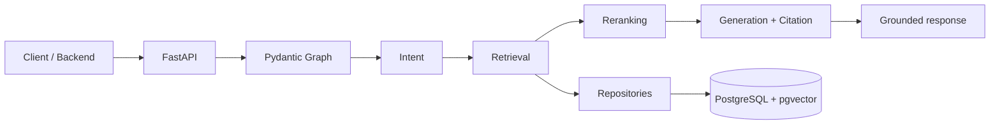

### [UNISAGE-xxx] [Short title]

> PR title example: `[UNISAGE-3] Initialize the UniSage Agent Repository`

---

#### Jira

<!-- jira-link:start -->
The Jira link is added automatically from the PR title or branch name.
<!-- jira-link:end -->

---

#### Root cause / Context

[Bug: root cause of the issue. Feature: background context and problem being solved.]

---

#### Change

[2-3 key behavioral changes in this PR, not line-by-line code details.]

---

#### Flow

---

#### Impact

[Affected flows, modules, API endpoints, or UI areas.]

---

#### Test

[How it was tested: unit test commands, manual steps, input -> expected output.]

---

#### Note

[Reviewer notes: edge cases, limitations, breaking changes, migration steps. Write "None" if not applicable.]
