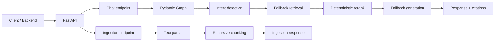

# UniSage AI Agent (`unisage-agent`)

`unisage-agent` is the AI/RAG and graph orchestration service for the UniSage
academic assistant. The current repository is a lightweight base scaffold built
with FastAPI, Pydantic Graph, SQLAlchemy, PostgreSQL, and pgvector.

The service is organized as a pipeline-oriented modular monolith so each RAG
stage can be implemented incrementally without introducing full DDD or
Hexagonal layers too early.

## Quick Start

### Requirements

- Python 3.12+
- [go-task](https://taskfile.dev/) for Taskfile commands
- PostgreSQL 16 with pgvector when running migrations or persistence features

PostgreSQL and external model keys are not required to try the current
provider-free fallback flow.

### Windows PowerShell

```powershell
cd unisage-agent

py -3.12 -m venv .venv
.venv\Scripts\python.exe -m pip install -e ".[dev]"
Copy-Item .env.example .env

task be:dev
```

Run the server directly when `go-task` is unavailable:

```powershell
.venv\Scripts\python.exe -m uvicorn app.main:app --reload --port 8000
```

### Linux / macOS

```bash
cd unisage-agent

python3.12 -m venv .venv
.venv/bin/python -m pip install -e ".[dev]"
cp .env.example .env

task be:dev
```

## API Endpoints

- Swagger UI: `http://127.0.0.1:8000/docs`
- ReDoc: `http://127.0.0.1:8000/redoc`
- Health: `GET /api/v1/health`
- Chat: `POST /api/v1/chat`
- Text ingestion: `POST /api/v1/ingestion`

## Development Commands

```powershell
# Show the command menu
task

# Application
task be:dev

# Tests and coverage
task test
task test:cov
task test:cov:html

# Code quality
task code:check
task code:check-strict
task code:fix

# Database
task db:up
task db:current
task db:history
task db:migrate -- "migration message"
```

Run `task --list-all` to see every available command.

## Project Structure

```text
unisage-agent/
|-- app/
|   |-- main.py              # FastAPI application entry point
|   |-- api/                 # Routes and request dependency wiring
|   |-- core/                # Settings and cross-cutting concerns
|   |-- rag/
|   |   |-- ingestion/       # Loading, parsing, and ingestion orchestration
|   |   |-- chunking/        # Recursive and semantic chunking
|   |   |-- embeddings/      # Embedding implementations
|   |   |-- retrieval/       # Vector, keyword, hybrid, and context building
|   |   |-- reranking/       # Reranking implementations
|   |   `-- generation/      # Grounded responses, citations, and suggestions
|   |-- graph/               # Pydantic Graph state and orchestration nodes
|   |-- database/            # Async sessions, models, and repositories
|   `-- schemas/             # API and pipeline contracts
|-- docs/                    # Architecture and onboarding documentation
|-- migrations/              # Alembic environment and versions
|-- scripts/                 # Development utilities
|-- storage/                 # Local development storage
|-- taskfiles/               # Modular Taskfile commands
|-- tests/                   # Pytest suite
`-- .devcontainer/           # Python and PostgreSQL/pgvector environment
```

Dependency direction:

```text
API -> Graph -> RAG services -> Database repositories
```

API handlers validate and delegate. Graph nodes orchestrate the RAG stages.
Provider logic stays in its corresponding RAG package, while SQL stays in
repositories.

## Current Runtime Flow



The base currently uses an in-memory fallback corpus, deterministic scoring,
deterministic reranking, and provider-free generation. It validates the API,
package boundaries, graph execution, metadata visibility, citations, and tests
without claiming the complete SRS pipeline is already implemented.

The target SRS-aligned pipeline, including trusted access context, HyDE,
sub-query routing, Dense/BM25/RRF retrieval, Cross-Encoder reranking, context
compression, and safe fallback behavior, is documented in
[`docs/architecture/rag-pipeline.md`](docs/architecture/rag-pipeline.md).

## Database

Start PostgreSQL with pgvector:

```powershell
docker compose -f .devcontainer/docker-compose.yml up -d db
task db:up
```

The initial ingestion endpoint only parses and chunks text. Persisting
documents, embeddings, and vectors is follow-up work.

## Verification

```powershell
task test
task code:check-strict
```

## Commit and Branch Conventions

- Branch: `<prefix>/<owner>-<task-id>-<short-name>`
- Commit: `<type>(<scope>): [UNISAGE-xxx] <short English title>`
- Use English Conventional Commits without emoji.
- Never commit directly to `main` or force-push a shared branch.

Example:

```text
feature/huyen-unisage-02-rag-agent-base
feat(rag): [UNISAGE-02] implement retrieval flow
```

## Documentation

See [`docs/README.md`](docs/README.md) for the documentation index.
