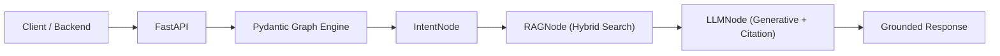

# UniSage AI Agent (`unisage-agent`)

**UniSage AI Agent** là dịch vụ xử lý AI RAG Engine & Pydantic Graph State Machine cho Hệ thống Trợ lý Học vụ Thông minh **UniSage** (IUH).

Dự án kết hợp tìm kiếm lai (Hybrid Vector + Keyword Search với `pgvector` và `tsvector`), tái xếp hạng (Reranking), và luồng xử lý suy luận định hướng trạng thái (State-machine graph bằng `pydantic-graph`).

---

## Quick Start

### Requirements

- Python >= 3.12
- PostgreSQL với extension `pgvector` enabled
- (Tùy chọn) [uv](https://github.com/astral-sh/uv) package manager hoặc Docker với VS Code DevContainers

### Installation & Local Setup

```bash
# 1. Clone repository & truy cập thư mục
cd unisage-agent

# 2. Setup môi trường Python ảo (.venv)
python -m venv .venv
.venv\Scripts\Activate.ps1   # Windows PowerShell
# source .venv/bin/activate  # Linux / macOS

# 3. Cài đặt dependencies
pip install -e .[dev]

# 4. Tạo file cấu hình môi trường
cp .env.example .env
# Chỉnh sửa .env với OPENAI_API_KEY và DATABASE_URL của bạn

# 5. Chạy database migrations (Alembic)
task db:up
```

### Start Development Server

```bash
task dev         # Backend Server → http://127.0.0.1:8000
```

* **Swagger API Docs:** http://127.0.0.1:8000/docs
* **ReDoc:** http://127.0.0.1:8000/redoc

---

## Key Automation Commands (`Taskfile.yml`)

```bash
# Development
task dev                  # Chạy FastAPI dev server với auto-reload

# Testing & Coverage
task test                 # Chạy tất cả Pytest unit tests
task test:cov             # Tự động xuất báo cáo test coverage trên terminal
task test:cov:html        # Tạo báo cáo HTML chi tiết trong htmlcov/

# Code Quality & Format
task code:check           # Kiểm tra linter (ruff) và type check (mypy)
task code:check-strict    # Kiểm tra nghiêm ngặt trước khi tạo Pull Request
task code:format          # Tự động format code (ruff format)

# Database & Migrations
task db:up                # Apply tất cả migrations lên PostgreSQL
task db:migrate           # Tạo migration mới từ SQLAlchemy Models

task help                 # Xem danh sách tất cả lệnh hỗ trợ
```

---

## Project Structure

```
unisage-agent/
├── app/
│   ├── main.py              # Entry point ứng dụng FastAPI
│   ├── api/                 # API Routes (V1)
│   ├── core/                # Infrastructure (config, db, exceptions, middleware, trace, sanitizer)
│   ├── domains/             # Business Domains
│   ├── graph/               # Orchestration State Machine (pydantic-graph)
│   │   ├── nodes/           # Graph Nodes (IntentNode, RAGNode, LLMNode, GreetingNode)
│   │   ├── state.py         # ChatState Dataclass
│   │   ├── deps.py          # ChatDeps Dependency Injection
│   │   └── graph.py         # Graph Topology Definition
│   ├── schemas/             # Pydantic Request/Response Models
│   └── services/            # Retrieval, Embedding, Chunking & Ingestion Services
├── database/                # Alembic database migrations & config
├── docs/                    # Tài liệu kiến trúc dự án & Onboarding (xem docs/README.md)
├── scripts/                 # Utility Scripts (ví dụ: tạo sơ đồ Mermaid từ Pydantic Graph)
├── storage/                 # Thư mục chứa dữ liệu thô (.jsonl, .pdf uploads)
├── taskfiles/               # Modular Taskfile automation
├── tests/                   # Pytest suite (health, chat, graph nodes)
└── .devcontainer/           # Cấu hình Docker & VS Code DevContainers
```

---

## Architecture & Graph Pipeline

### Chat Graph (`pydantic-graph`)



Luồng xử lý gồm 4 Node chính:
1. **GreetingNode**: Phản hồi chào hỏi nhanh cho các câu hỏi tổng quan.
2. **IntentNode**: Phân loại ý định sinh viên (Single-intent vs Multi-intent sub-queries).
3. **RAGNode**: Tìm kiếm truy vấn lai (pgvector Cosine Similarity + tsvector Full-text Search + RRF Fusion).
4. **LLMNode**: Sinh câu trả lời grounding từ tài liệu kèm trích dẫn nguồn (Citations).

---

## Commit & Branch Conventions

Tuân thủ chuẩn **English Conventional Commits** không dùng emoji (xem chi tiết tại [SKILL.md](.agents/skills/git-commit-instructions/SKILL.md)):

* **Tên Branch:** `<prefix>/<owner>-<task-id>-<short-name>` (VD: `feature/huy-unisage-3-hybrid-retrieval`)
* **Format Commit:** `<type>(<scope>): [UNISAGE-xxx] <short title in English>`

---

## License & Support

Dự án thuộc Khoá luận tốt nghiệp **UniSage Academic Assistant System** - Đại học Công nghiệp TP.HCM (IUH).
