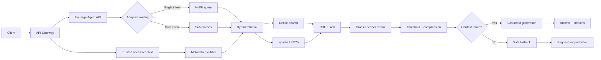

# RAG Pipeline Architecture

This document summarizes the target UniSage RAG flow from the SRS. It is a
direction for incremental development, not a claim that every stage is already
implemented.

## Service Boundary

- The API Gateway and backend authenticate users and provide trusted access
  context.
- `unisage-agent` owns query orchestration, retrieval, reranking, grounded
  generation, and citations.
- Authentication, users, roles, tickets, and general administration remain in
  `unisage-backend`.
- Production retrieval must not trust faculty, organization, role, or access
  level values supplied directly by a client.

## Target Query Flow



The trusted access context contains values such as:

- user role;
- allowed organization or knowledge-package scopes;
- maximum document access level.

These constraints are applied before retrieval. A second check should run
before selected chunks enter the LLM context.

## Pipeline Stages

| Stage | Responsibility | Package |
| --- | --- | --- |
| Request | Validate input and receive trusted access context | `app/api` |
| Routing | Classify single- or multi-intent queries | `app/graph` |
| Transformation | Build a HyDE query or decompose sub-queries | `app/rag/retrieval` |
| Retrieval | Apply access filters, dense search, BM25, and RRF | `app/rag/retrieval` |
| Post-retrieval | Rerank, threshold, and compress context | `app/rag/reranking` |
| Generation | Produce a grounded answer or safe fallback | `app/rag/generation` |
| Citation | Return document and chunk references | `app/rag/generation` |

Graph nodes orchestrate these stages. Provider calls, ranking algorithms, SQL,
and prompt construction stay in their corresponding RAG or repository package.

## Current Base Scope

The initial project setup intentionally implements a small, provider-free
execution path:

```text
API -> intent -> fallback retrieval -> deterministic rerank -> response
```

It exists to validate package boundaries, graph execution, API contracts, and
tests without requiring an external model or vector database. HyDE, sub-query
branching, PostgreSQL/pgvector retrieval, BM25/RRF, a cross-encoder, context
compression, and model-backed generation are follow-up features.

Each follow-up should replace one fallback behind the existing stage boundary
instead of introducing all target components at once.
