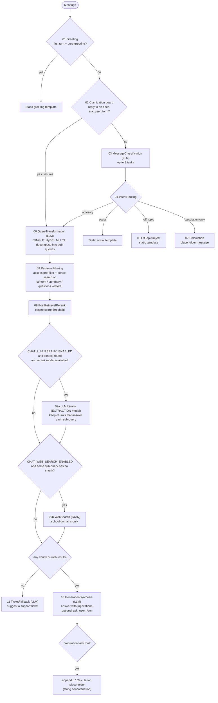
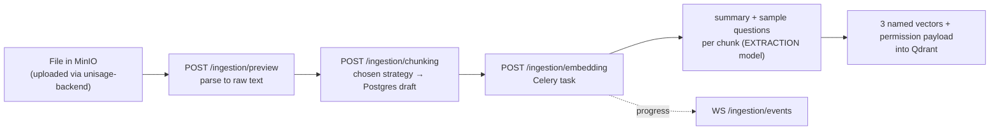

# RAG Pipeline Architecture

How a chat turn and a document ingestion actually run today. Product rules are in
[`docs/product/PRODUCT.md`](../product/PRODUCT.md); deliberate gaps against the original
design (BM25, RRF, cross-encoder, calculation) are in
[`docs/specs/known-gaps.md`](../specs/known-gaps.md).

## Service Boundary

- The API Gateway authenticates the user and injects 5 trusted headers (`X-User-Id`,
  `X-User-Role`, `X-User-Code`, `X-User-Department-Access`, `X-User-Permissions`) plus
  `X-Internal-Secret`. This service never decodes a JWT; no `X-User-Id` means a guest.
- `unisage-backend` (Java) owns conversations and messages. Each turn this service reads
  history from Java, posts the USER message and an ASSISTANT placeholder, then patches the
  final answer and citations back. It never stores conversation content itself.
- Document access comes only from `department_access` in those headers, applied as a Qdrant
  pre-filter before any search. Facts a student states in the conversation never widen it.

## The Orchestrator

`app/graph/streaming_graph.py::run_graph` is **one async function** that branches with
plain `if` statements. It is **not** a `pydantic_graph.Graph`: `Graph.run()` returns a
single final output and can't stream tokens, which this endpoint needs (SSE). Node names
(`01_…` to `11_…`) are labels for `GraphTrace` logs and for matching the original design;
each node's logic lives in `app/graph/nodes/`.

`POST /api/v1/chat/stream` (`app/api/v1/chat.py`) validates the request, sanitizes the
message, logs suspected prompt injection (log-only), does the Java calls above, then runs
`run_graph` as a background task whose tokens the SSE response reads from a queue, so the
answer is still persisted if the client disconnects.

## Chat Flow

Notes:

- **09a and 09b are optional.** 09a runs only when `CHAT_LLM_RERANK_ENABLED` is on, 09 found
  context, and an EXTRACTION model is available; if the model is unavailable or fails, the
  turn continues with 09's result and an admin warning. 09b runs only when
  `CHAT_WEB_SEARCH_ENABLED` is on and at least one sub-query was left with no chunk.
- **Rerank is a threshold, not a cross-encoder.** 09 sorts by the best cosine score across the
  3 named vectors and drops chunks under `CHAT_RERANK_SCORE_THRESHOLD`.
- **Citations** are built from the chunks and web pages the model cited by `[n]`
  (`app/rag/prompting/citations.py`); the model never supplies a source itself.
- **Prompt framing:** retrieved text sits inside `<academic_context>` / `<websearch>`, declared
  as data, with any frame tag inside the text escaped.
- **Clarification:** 10 can end with an `ask_user_form` block; the open round is stored in
  Postgres and the next reply re-enters at 02 → 06.

## Ingestion Flow

Supported inputs: PDF, DOCX, TXT, XLSX (`.doc` is not). Chunking strategies: recursive,
token-based, semantic, markdown-aware, table-row (row-atomic tables), Excel-row. Details and
invariants are in [`docs/specs/SPEC-ingestion.md`](../specs/SPEC-ingestion.md).
